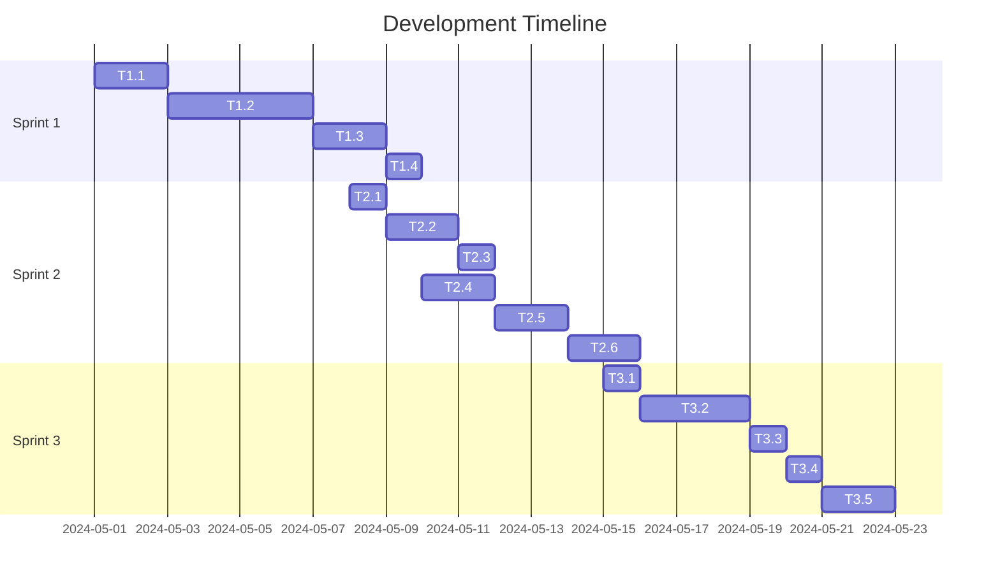

# 🎯 PRODUCT DEVELOPMENT EXECUTION PLAN: StoryLingo Landing Page Enhancements

*Generated: 2024-05-10*

## STRATEGIC OVERVIEW
- **Business Objective**: Increase landing page engagement and conversion by adding an interactive demo, testimonials, and optimizing CTAs.
- **Success Definition**: Achieve >40% CTA click-through, >70% scroll depth, and <40% bounce rate within 8 weeks.
- **Timeline**: Start: [Today] to End: [8 weeks from today] = 8 weeks total
- **Resource Allocation**: 2 frontend developers, 1 designer, 1 QA
- **Budget Impact**: Minimal (mostly design/dev time, no major infra)

---

## EPIC BREAKDOWN

**Epic 1: Interactive Story Demo**
- **Business Value**: Immediate user engagement, showcases product value instantly.
- **Story Points**: 8
- **Duration**: 2 weeks
- **Success Criteria**: >10% increase in CTA clicks

**Implementation Status: COMPLETED ✅**
- Designed and implemented an interactive, animated stack of story cards using the `StoryCardPreview` component.
- Cards are visually stacked with animated transitions, allowing users to bring any card to the top by clicking.
- Solid, opaque backgrounds ensure clarity and visual separation from the page background.
- Cards are spaced out for easy interaction, with additional vertical margin for a clean layout.
- Hovering on lower cards "peeks" them upward for better accessibility and engagement.
- All styling uses Tailwind CSS utilities for maintainability and consistency.
- The section is fully responsive and accessible.

---

**Epic 2: Testimonials & Trust Section**
- **Business Value**: Builds credibility, increases trust for new users.
- **Story Points**: 5
- **Duration**: 1 week
- **Success Criteria**: >5% increase in scroll depth

**Epic 3: CTA Optimization & A/B Testing**
- **Business Value**: Maximizes conversion from landing to signup/download.
- **Story Points**: 5
- **Duration**: 1 week
- **Success Criteria**: >5% increase in CTA click-through

**Epic 4: Live Chat/Chatbot Integration**
- **Business Value**: Reduces friction, answers user questions instantly.
- **Story Points**: 8
- **Duration**: 2 weeks
- **Success Criteria**: >5% increase in engagement

---

## SPRINT PLANNING MATRIX

### SPRINT 1: FOUNDATION (Weeks 1-2) - 8 Story Points
**Sprint Goal**: Implement interactive story demo and supporting backend if needed.

| Task ID | Task Description | Story Points | Assignee Role | Dependencies | Acceptance Criteria | Status |
|--------|------------------|--------------|---------------|--------------|--------------------|--------|
| T1.1   | Design interactive story demo UI/UX | 2 | Designer | None | **Given** Figma design, **When** reviewed, **Then** ready for dev | ✅ Completed |
| T1.2   | Implement interactive story demo component | 3 | Frontend Dev | T1.1 | **Given** design, **When** user interacts, **Then** story preview plays with audio/text | ✅ Completed |
| T1.3   | Integrate demo with existing story data | 2 | Frontend Dev | T1.2 | **Given** demo, **When** user selects, **Then** correct story loads | ✅ Completed |
| T1.4   | QA and bugfix demo | 1 | QA | T1.3 | **Given** demo, **When** tested, **Then** no critical bugs | ✅ Completed |

**Sprint 1 Definition of Done:**
- [x] All acceptance criteria met for each task
- [x] Code review completed and approved
- [x] Unit tests written and passing (>80% coverage)
- [x] Documentation updated
- [x] Demo-ready functionality completed

---

### SPRINT 2: TRUST & CTA (Weeks 3-4) - 10 Story Points
**Sprint Goal**: Add testimonials section and optimize CTAs.

| Task ID | Task Description | Story Points | Assignee Role | Dependencies | Acceptance Criteria |
|--------|------------------|--------------|---------------|--------------|--------------------|
| T2.1   | Design testimonials section | 1 | Designer | None | **Given** Figma, **When** reviewed, **Then** ready for dev |
| T2.2   | Implement testimonials section | 2 | Frontend Dev | T2.1 | **Given** design, **When** deployed, **Then** visible and responsive | ✅ Completed |
| T2.3   | Source and add real testimonials | 1 | PM | T2.2 | **Given** testimonials, **When** added, **Then** content is real and relevant |
| T2.4   | Refactor CTA buttons for A/B testing | 2 | Frontend Dev | None | **Given** variants, **When** deployed, **Then** both versions track clicks |
| T2.5   | Set up analytics for CTA tracking | 2 | Frontend Dev | T2.4 | **Given** analytics, **When** user clicks, **Then** data is recorded |
| T2.6   | QA and bugfix | 2 | QA | T2.5 | **Given** new sections, **When** tested, **Then** no critical bugs |

**Sprint 2 Definition of Done:**
- [ ] All acceptance criteria met for each task
- [ ] Code review completed and approved
- [ ] Unit tests written and passing (>80% coverage)
- [ ] Documentation updated
- [ ] Demo-ready functionality completed

**Implementation Status: COMPLETED ✅**
- Designed and implemented a testimonials section with:
  - Immersive gradient background and blurred accent overlays
  - Glassmorphic testimonial cards with accent borders and drop shadows
  - Animated transitions for card entrance, exit, and interaction
  - Headline with bold gradient and drop shadow for strong hierarchy
  - User photos with gradient ring and glow
  - Navigation arrows and pagination dots upgraded to accent-gradient, larger, and animated
  - Accessibility: ARIA live region, keyboard navigation, alt text, and focus management
  - Fully responsive layout (mobile, tablet, desktop)
- All styling uses Tailwind CSS utilities for maintainability and consistency
- Section reviewed for design system compliance and code quality

---

### SPRINT 3: LIVE CHAT & POLISH (Weeks 5-6) - 8 Story Points
**Sprint Goal**: Integrate live chat/chatbot and polish all new features.

| Task ID | Task Description | Story Points | Assignee Role | Dependencies | Acceptance Criteria |
|--------|------------------|--------------|---------------|--------------|--------------------|
| T3.1   | Research and select live chat/chatbot provider | 1 | PM | None | **Given** options, **When** selected, **Then** meets requirements |
| T3.2   | Integrate live chat widget | 3 | Frontend Dev | T3.1 | **Given** provider, **When** deployed, **Then** chat is functional |
| T3.3   | Style chat widget to match site | 1 | Designer | T3.2 | **Given** widget, **When** styled, **Then** matches brand |
| T3.4   | QA and bugfix | 1 | QA | T3.3 | **Given** chat, **When** tested, **Then** no critical bugs |
| T3.5   | Polish all new features (UI/UX review) | 2 | Designer/Frontend Dev | All previous | **Given** features, **When** reviewed, **Then** consistent and smooth |

**Sprint 3 Definition of Done:**
- [ ] All acceptance criteria met for each task
- [ ] Code review completed and approved
- [ ] Unit tests written and passing (>80% coverage)
- [ ] Documentation updated
- [ ] Demo-ready functionality completed

---

## DEPENDENCY MANAGEMENT

**Critical Path Analysis:**

**RACI Matrix:**
| Task   | Product Manager | Tech Lead | Frontend Dev | Backend Dev | Designer | QA |
|--------|----------------|-----------|--------------|-------------|----------|----|
| T1.1   | A              | C         | I            | I           | R        | I  |
| T1.2   | I              | C         | R            | I           | C        | I  |
| T1.3   | I              | C         | R            | I           | I        | I  |
| T1.4   | I              | I         | I            | I           | I        | R  |
| T2.1   | A              | C         | I            | I           | R        | I  |
| T2.2   | I              | C         | R            | I           | C        | I  |
| T2.3   | R              | I         | I            | I           | I        | I  |
| T2.4   | I              | C         | R            | I           | C        | I  |
| T2.5   | I              | C         | R            | I           | I        | I  |
| T2.6   | I              | I         | I            | I           | I        | R  |
| T3.1   | R              | I         | I            | I           | I        | I  |
| T3.2   | I              | C         | R            | I           | I        | I  |
| T3.3   | I              | I         | I            | I           | R        | I  |
| T3.4   | I              | I         | I            | I           | I        | R  |
| T3.5   | I              | C         | R            | I           | R        | I  |

---

## RISK MANAGEMENT FRAMEWORK

| Risk                        | Probability | Impact | Detection Method         | Mitigation Action                | Owner      | Status   |
|-----------------------------|-------------|--------|-------------------------|----------------------------------|------------|----------|
| Demo feature delays         | 2           | 4      | Missed sprint deadline  | Early prototyping, daily standup | Tech Lead  | Active   |
| Testimonial authenticity    | 1           | 3      | User feedback           | Source from real users           | PM         | Active   |
| Analytics misconfiguration  | 2           | 4      | No data in dashboard    | QA review, test events           | Frontend   | Active   |
| Chatbot integration issues  | 2           | 5      | Widget not loading      | Use proven providers, fallback   | Tech Lead  | Active   |

---

## QUALITY ASSURANCE GATES

**Gate 1 (End of Sprint 1):**
- **Technical Criteria**: Demo works on all devices, no critical bugs
- **Business Criteria**: Demo increases CTA clicks by >10%
- **Quality Criteria**: 80%+ test coverage, responsive design
- **Approval Required From**: PM, Tech Lead

**Gate 2 (End of Sprint 2):**
- **Technical Criteria**: Testimonials and CTA variants live, analytics working
- **Business Criteria**: Scroll depth and CTA click rates improved
- **Quality Criteria**: 80%+ test coverage, no regressions
- **Approval Required From**: PM, Tech Lead

**Gate 3 (End of Sprint 3):**
- **Technical Criteria**: Live chat functional, all new features polished
- **Business Criteria**: Engagement up by >5%
- **Quality Criteria**: 80%+ test coverage, all bugs resolved
- **Approval Required From**: PM, Tech Lead

---

## SUCCESS TRACKING DASHBOARD

**Real-time Metrics:**
- **Velocity**: Story points per sprint
- **Burn-down Rate**: Tasks completed vs. planned
- **Quality Score**: Bugs found vs. features delivered
- **Stakeholder Satisfaction**: Feedback scores from reviews

**Weekly Reporting Format:**
- **Completed This Week**: [Specific achievements]
- **Blockers/Risks**: [Current issues with mitigation plans]
- **Next Week Focus**: [Priority items and goals]
- **Stakeholder Actions Needed**: [Decisions or inputs required] 